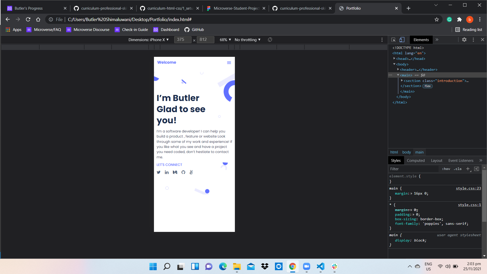

# Portfolio

>Building a Portfolio to show what I'm truly capable of as a developer, as well as showing my future recruiters and hiring managers to get an idea of what I can bring to their teams..

Additional description about the project and its features.

## Built With

- HTML
- CSS

## Live Demo

[Live Demo Link When Available](https://livedemo.com)

## Getting Started

**This is an example of how you may give instructions on setting up your project locally.**
**Modify this file to match your project, remove sections that don't apply. For example: delete the testing section if the currect project doesn't require testing.**

To get a local copy up and running follow these simple example steps.

## Setup

## Authors

👤 **Butler Muwo**

- GitHub: [@butlermuwo](https://github.com/githubhandle)
- Twitter: [@ButlerMuwo](https://twitter.com/twitterhandle)
- LinkedIn: [www.linkedin.com/in/butler-shimaluwani-41a680159](https://linkedin.com/in/www.linkedin.com/in/butler-shimaluwani-41a680159)

## 🤝 Contributing

Contributions, issues, and feature requests are welcome!

Feel free to check the [issues page](../../issues/).

## Show your support

Give a ⭐️ if you like this project!

## Acknowledgments

- Hat tip to anyone whose code was used
- Inspiration
- etc

## 📝 License

This project is [MIT](./MIT.md) licensed.
